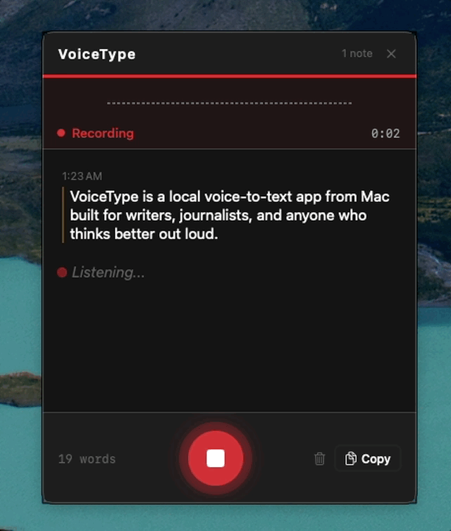
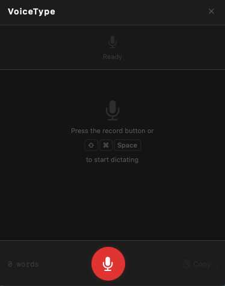
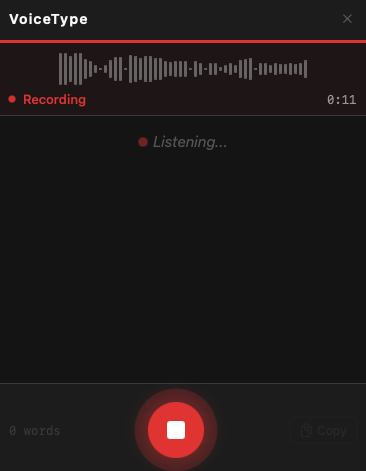
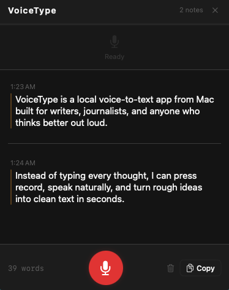

# VoiceType

A local voice-to-text app for Mac built for writers, journalists, and anyone who thinks better out loud.

VoiceType is a lightweight dictation app for macOS that turns speech into text locally on your machine. It is designed for drafting notes, outlines, articles, and long thoughts with minimal friction. Press record, speak naturally, and turn rough ideas into text without sending your audio to a remote server.

## Highlights

- Local speech-to-text for Mac
- Built for writers, journalists, and fast thinkers
- Lightweight floating capture pad
- Live transcription preview
- Privacy-first workflow
- Simple menu bar app with a global hotkey

## Screenshots

### Ready to dictate

### Recording in progress

### Finished transcript

## Download

The simplest way to get VoiceType is to download the latest `.dmg` from GitHub Releases.

## Install VoiceType

1. Download the latest `.dmg`
2. Open it
3. Drag `VoiceType.app` into the `Applications` folder
4. Try opening VoiceType from `Applications`
5. If macOS blocks it, go to `System Settings > Privacy & Security`
6. Click `Open Anyway`
7. Return to `Applications` and open VoiceType again

`INSTALL FIRST.txt` is included inside the DMG for quick setup guidance.

## Why VoiceType Exists

There are already dictation tools on the market, but many of them are expensive, cloud-dependent, or overloaded with features. VoiceType takes a different approach: it is native to macOS, local-first, lightweight, and shaped by a writer’s workflow rather than a generic productivity stack.

## What Ships In v0.1.2

VoiceType currently includes:

- local transcription on macOS using WhisperKit
- a menu bar app that stays out of the way until you need it
- a floating notepad for recording and collecting text blocks
- a global hotkey: `Command + Shift + Space`
- optional live transcription preview while you speak
- session word count and recent transcription history

## Coming Soon

Planned improvements include:

- direct insertion into the app you are actively using
- cleanup modes for raw, clean, and polished transcription
- better export workflows for writers and journalists
- longer-session handling beyond the current in-memory limit
- additional onboarding and desktop polish

## How To Use VoiceType

VoiceType is meant to be straightforward.

1. Launch VoiceType. It will live in your menu bar.
2. Open the floating notepad from the menu bar.
3. Press `Command + Shift + Space` or click the record button.
4. Speak naturally.
5. Press the hotkey again, or click stop, when you are finished.
6. Copy one text block or copy the full session into the document you are writing.

On first use, VoiceType will prepare its speech model. That download can take a moment. After that, dictation should feel much faster.

## Permissions

VoiceType needs:

- **Microphone access** so it can hear your speech

Future versions that insert text directly into other apps may also require:

- **Accessibility access** so macOS allows the app to interact with the frontmost application

## Product Scope

VoiceType `v0.1.x` is a polished local dictation pad.

It does **not** yet try to automatically insert text into every app on your Mac. That feature may come later. For now, the goal is reliability, privacy, and a clean experience for recording and copying text.

## Tech Stack

- Swift / SwiftUI
- [WhisperKit](https://github.com/argmaxinc/WhisperKit)
- [HotKey](https://github.com/soffes/HotKey)
- SQLite for history

No Electron. No web view. No cloud account required.

## Contributing

Contributions are welcome. If you want to propose a substantial change, please open an issue first so the direction stays coherent.

## License

[MIT](LICENSE)
